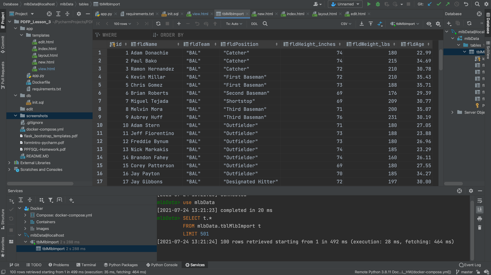
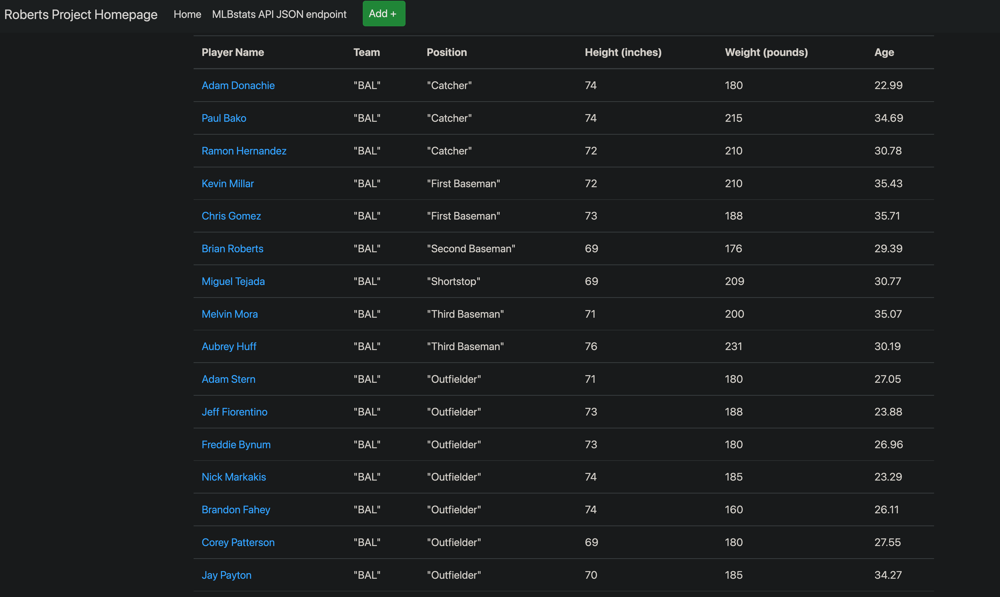
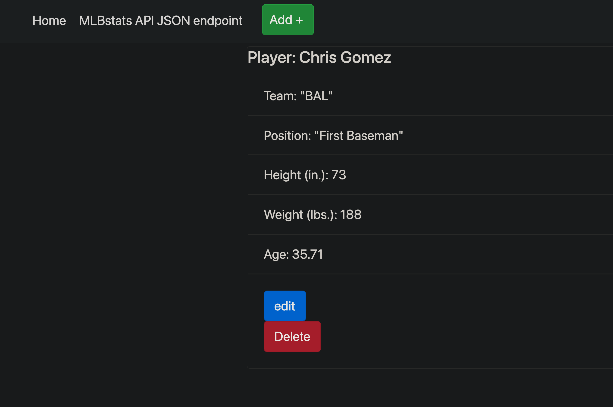
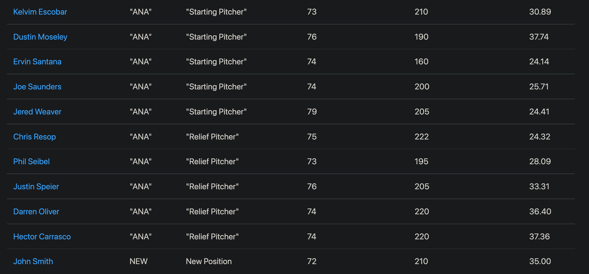
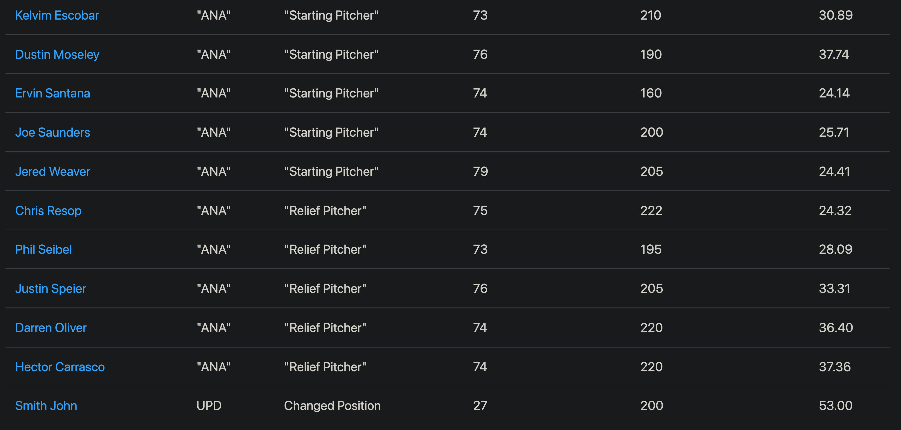
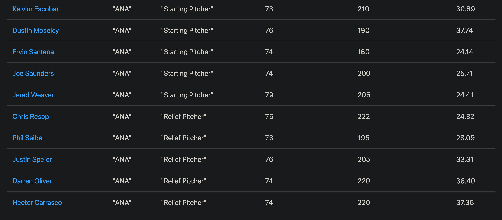

# Web Forms with Docker, Flask, and MySQL
+ This project is to demonstrate HTML forms which are capable of creating, updating, and deleting records.
+ Docker Compose is being utilized to setup a python flask app and a mysql server which will load data from
the db/init.sql file during the first start up of the database.
+ The flask framework is serving jinja template files and sending http POST
requests to create, update, and delete records.

## Screenshot of Table View in PyCharm:

## Screenshot of browser displaying homepage with new data:

## Screenshot of browser displaying view of individual data record:

## Screenshot of browser displaying new record in home page:
(Note: The new record is "John Smith")

## Screenshot of browser displaying modified record in home page:
(Note: The modified record is "Smith John", formerly "John Smith")

## Screenshot of browser displaying deleted record in home page:
(Note: The record was "Smith John")

